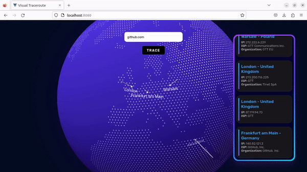
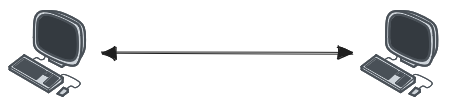
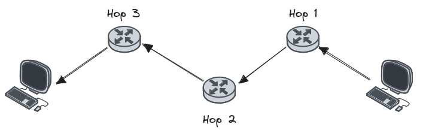

# Visual Traceroute <!-- omit in toc -->

- [What is this?](#what-is-this)
- [Sounds cool but what is Traceroute ?](#sounds-cool-but-what-is-traceroute-)
- [How do I try it ?](#how-do-i-try-it-)
    - [Using `Docker`](#using-docker)
    - [Using `npm`](#using-npm)
- [Acknowledgements](#acknowledgements)


## What is this?

This project is a simple web app that visualizes the results of the traceroute command on a globe. 

Given a URL, it traces the path in the internet to that destination, figures out where each public hop is located and draws the results on a 3D globe for visualization.



## Sounds cool but what is Traceroute ?

Traceroute is a networking utility. It's used to figure out the path to a host.

When we send a request to a computer on the internet (say to get a webpage), we don't talk to that computer directly. 



What happens is our request goes through multiple intermediate routers, Traceroute gives us useful information about the steps we take, like the IP of each router in the path, the time it took us to reach that router & more. 



Some of the routers hops along our path will be private & won't be be able to back send a response, others might timeout while responding to us. But overall we get a pretty solid idea of how the path is. 

You can run it on your computer to examine the output.
```bash
// Ubuntu
// You might need to run 'apt install traceroute' before this
traceroute github.com

// Windows
tracert github.com
```

## How do I try it ?

#### Using `Docker`

The easiest way to run this project is using [Docker](https://www.docker.com/) by running this command in the project's root directory.

```docker
docker compose up
```

Unfortunately this only works for Ubuntu and not Windows due to restrictions of networking in Windows.

#### Using `npm`

For this method you need [Node.js & npm](https://nodejs.org/en/download) insalled

Run the following commands to install dependencies then run the server & frontend.

```terminal
// in /server 
npm install
npm run build
npm run start

// another terminal in /frontend
npm run install
npm run serve
```

## Acknowledgements

This project would not be possible if not for the following awesome projects

- [Github Globe](https://github.com/janarosmonaliev/github-globe) - [janarosmonaliev](https://github.com/janarosmonaliev)
- [Node.js Trace](https://github.com/zulhilmizainuddin/nodejs-traceroute) - [zulhilmizainuddin](https://github.com/zulhilmizainuddin) 